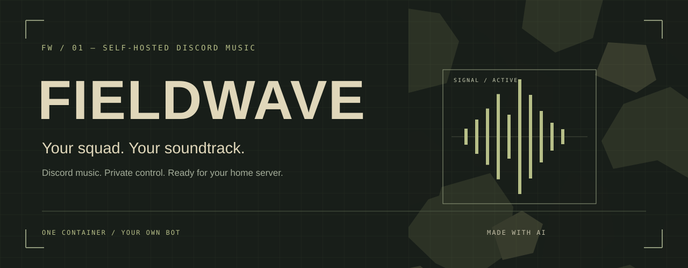
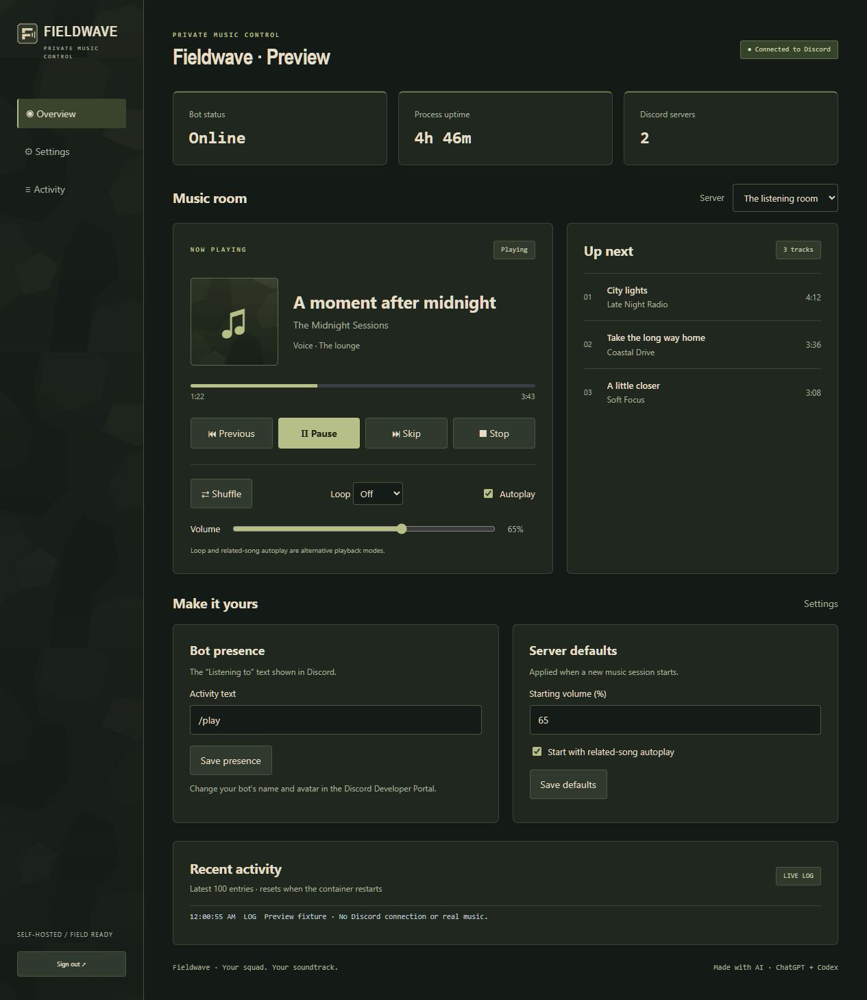

<div align="center">



<br>

**A self-hosted Discord music bot with a control panel you'll actually want to use.**

Your bot account. Your name and avatar. One container on your home server.


[**Install on Unraid →**](docs/UNRAID.md) · [Full setup](docs/SETUP.md) · [Made with AI](docs/AI.md) · [Publishing](docs/PUBLISHING.md)

</div>

---

## Good signal. Better company.

Fieldwave turns a Discord voice channel into a shared listening room. Search with `/play`, build a queue with friends, and let related-song autoplay keep things moving. Control the session from Discord or open the private web panel from your browser.



<sub>Panel preview with sample tracks. No live Discord connection is shown.</sub>

## The good stuff

| In your Discord | In your browser | On your server |
| --- | --- | --- |
| `/play` with search autocomplete | Now playing, artwork and progress | One Docker container |
| Interactive player card | Pause, skip, previous and stop | Prebuilt image through GHCR |
| Queue, shuffle and playback history | Loop, autoplay and volume | Unraid container template |
| Related-song autoplay | Per-server controls and defaults | Persistent local settings |
| Polls, dice and everyday utilities | Command switches and custom replies | No AI API key required |
| Custom `/rules`-style commands | Status, uptime and recent logs | Settings survive updates |

## Bring it home

Use **Unraid → Docker → Add Container** with the public image:

```text
ghcr.io/hellatactical/fieldwave:latest
```

Map **3000/TCP** for the web panel and **`/app/data`** for persistent settings. Add your Discord token, Application ID and a separate panel password. GitHub builds the image with all dependencies inside; Unraid only needs to pull it.

**[Follow the Unraid install guide →](docs/UNRAID.md)**

A personal [Unraid template](unraid/fieldwave.xml) is included. Fieldwave is not automatically listed in Community Applications. The [container package](https://github.com/hellatactical/fieldwave/pkgs/container/fieldwave) is public; no GitHub login is needed to download it.

<details>
<summary><strong>Prefer Compose or building it yourself?</strong></summary>

For a published image, set `FIELDWAVE_IMAGE` in `.env`, prepare the appdata permissions as described in the Unraid guide, then run:

```bash
docker compose -f compose.registry.yml up -d
```

For a local source build, the original `docker-compose.yml`, `unraid-start.sh` and `unraid-update.sh` remain available. They keep the original `home-discord-bot` container name and data path for compatibility. See [the full source-build guide](docs/SETUP.md).

</details>

## Simple by design

```text
Discord /play ──→ Fieldwave ──→ Discord Player + yt-dlp + FFmpeg ──→ Voice
                     ↑
              Private web panel
```

There is one process and no separate database service. The panel uses a password-protected session and controls the bot's existing playback queues. Its Commands page can disable built-in commands per server and create up to five simple server-specific replies such as `/rules`. Music starts through `/play` in Discord. Your bot identity belongs to your own Discord application.

## Made with AI. Built for a real home server.

Fieldwave was made with **ChatGPT and Codex**, with AI generating substantial parts of the code, interface, branding, tests and documentation under human direction. We say that openly. [Read the AI disclosure →](docs/AI.md)

AI is part of how the project was made; it is not a runtime dependency. The bot does not need an OpenAI account, subscription or API key. Related-song autoplay is provided by the music extractor.

## A few things to know

- Keep the admin panel on a trusted LAN or behind a private VPN/HTTPS proxy. The login controls all servers the bot joins.
- Settings survive container updates. Active queues, playback history, polls and web sessions restart with the process.
- Music-source extraction can break when providers change. Only play content you are authorized to access.
- Automated tests, configuration checks and the [Linux container build](https://github.com/hellatactical/fieldwave/actions/runs/33848362861) passed. Anonymous image access is verified. Live Discord voice playback still needs your bot credentials; see [validation details](docs/SETUP.md#validation-and-source-layout).

## Under the hood

Built on [discord.js](https://discord.js.org/), [Discord Player](https://discord-player.js.org/), [yt-dlp](https://github.com/yt-dlp/yt-dlp), and [FFmpeg](https://ffmpeg.org/). Third-party components retain their own licenses. Fieldwave is an independent project, not affiliated with Discord, Unraid or OpenAI.

---

<div align="center"><sub>FIELDWAVE &nbsp; / &nbsp; YOUR SQUAD. YOUR SOUNDTRACK.</sub></div>
